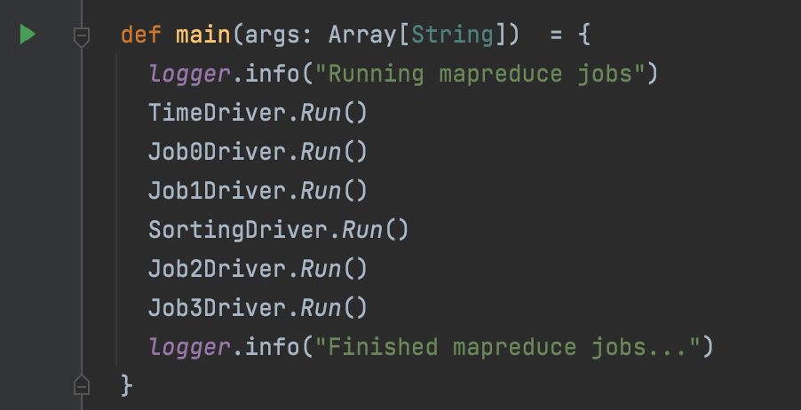

# Homework 2
### The goal of this homework is for students to gain experience with solving a distributed computational problem using cloud computing technologies. The main textbook group (option 1) will design and implement an instance of the map/reduce computational model. 
### Grade: 9%

## Author
Andrea Cappelletti  
UIN: 674197701   
acappe2@uic.edu

All the examples contained in this documentation are taken running the basic log file in
<code>input_dir</code>. 

The file contains only 5000 lines and the purpose is just to provide a clear explanation of the mapreduce
architecture.

The <code>output_dir</code> for that input file is provided as well, just for guidance.

Then a larger log file is provided under the section AWS YouTube Video.
# TimeInterval job
This job leads to the creation of different time intervals
to analyse the overall logs.

For simplicity, we consider just one entire log file, the name has to be specified into the config of our project in order to retrieve
the first line of the file and then create the time intervals.

The standard log file used to run the mapreduce so far is named <code>input.log</code> and is placed into the <code>input_dir/</code> directory in HDFS.

In order to create the interval, the very first log message is taken into account and sent to every mapper through a configuration param.
```
conf.set("startTime", startTimeInterval)
```
Next step is to decide time window in milliseconds, that we can set from the config
```
timeWindow = 5000
```
The TimeInterval job will automatically generate our interval for us.

In fact, once the mapper knows the first time interval and the time window, it is easy
to compute the interval of a given time interval.


The output is all the log messages with the defined time interval.

### Mapper
The mapper is located into the <code>TimeMapper</code> class.

It basically takes the log lines one by one, detect the timestamp of the log,
computes the time interval and return the time interval as a key and the entire log message as a value.

The time interval is computed as explained above and then rounded.

We can consider the example of key-value pair below. Where 1024 is the time interval and the value is the log message.
```
key : 0
value: 23:13:30.515 [scala-execution-context-global-90] WARN  HelperUtils.Parameters$ - Max count 5000 is used to create records instead of timeouts
```
### Reducer
The reducer is located into the <code>TimeReducer</code> class.
It takes each key from the mapper and simply output all the values computed.

### Input
The input of this mapreduce job is taken from the<code> input_dir/ </code>directory, that contains the initial log messages file.

### Output
The output will be a CSV with the time interval and the log message
```
0,23:13:30.515 [scala-execution-context-global-90] WARN  HelperUtils.Parameters$ - Max count 5000 is used to create records instead of timeouts
0,23:13:30.670 [scala-execution-context-global-90] WARN  HelperUtils.Parameters$ - s%]s,+2k|D}K7b/XCwG&@7HDPR8z
0,23:13:30.716 [scala-execution-context-global-90] INFO  HelperUtils.Parameters$ - ;kNI&V%v<c#eSDK@lPY(
0,23:13:30.752 [scala-execution-context-global-90] INFO  HelperUtils.Parameters$ - l9]|92!uHUQ/IVcz~(;.Uz%K*5jTUd08

...

1,23:13:35.700 [scala-execution-context-global-90] DEBUG HelperUtils.Parameters$ - r'VLq1]8C(S@WqQ(Ye
1,23:13:35.136 [scala-execution-context-global-90] INFO  HelperUtils.Parameters$ - ,7xnHe1<|>FGp%Y]7,|z*^zd2~%Q)J0z(o30PL]p
1,23:13:35.152 [scala-execution-context-global-90] INFO  HelperUtils.Parameters$ - 'DgLM5x5NZ]el`hXj/2Ww13Z)h>i#uclxniZ
1,23:13:35.167 [scala-execution-context-global-90] INFO  HelperUtils.Parameters$ - r#yDy*7\F*u{M;lE}w4`V&V!Gf:2pmpMm_R5-K9I0oBx]tAm1W%/|{

...

2,23:13:41.921 [scala-execution-context-global-90] INFO  HelperUtils.Parameters$ - VI`voJ3XuI:=)~A8_|j|wIGby5AXKOue#%R"[[
2,23:13:41.939 [scala-execution-context-global-90] INFO  HelperUtils.Parameters$ - {.q=E<e|5:E_?!KB[\|d0qR,tmv7]Hw1CX3lc.Dc67t~t&VO0B{$3i*N#p
2,23:13:41.956 [scala-execution-context-global-90] DEBUG HelperUtils.Parameters$ - 1@<~,1nb5O5f*vQw<)M7C3VE>yp*{L;n{DN;Kv8Niy-!KveeyT
2,23:13:41.972 [scala-execution-context-global-90] INFO  HelperUtils.Parameters$ - .-a=KjzAKa/!0?#{GEf_\QZVOK)APj!Z^@,%`./Y(wm>Px
2,23:13:41.989 [scala-execution-context-global-90] WARN  HelperUtils.Parameters$ - ?!(BDfoKvD~gk'P50"C;Tih{X\7#f}Cw

```

As we can see the first log messages are in time interval 0 and the second ones are in time interval 1, and so on.

The entire output will be stored into the <code>output_dir/time_interval</code> directory and 
then fed as input in the next jobs.

# Job0

> Compute a spreadsheet or an CSV file that shows the distribution of different types of messages across predefined time intervals and injected string instances of the designated regex pattern for these log message types.

### Mapper
The mapper is located into the <code>Job0Mapper</code> class.

It basically takes each log message as input with the time interval computed in the previous job.
It checks if the log message contains the regular expression we are looking for and print out the result.

In order to do that, we set the time interval and the log level (INFO,WARN, DEBUG ... ) as a key, the number 1 to compute the frequency sum and either 1 or 0 if the regural expression
is found into the message.

```
key : 0,DEBUG
value: 1,1
```

In the example above we have a log message at time interval 0 that contains the regular expression.

```
key : 0,DEBUG
value: 1,0
```
In this second example, the log message does not contain the regex.

### Reducer
The reducer is located into the <code>Job0Reducer</code> class.

It performs a <code>FoldLeft</code> operation to sum both the frequency of the log type in the interval and the
regex pattern matches.

### Input
The input of this mapreduce job is taken from the<code> output_dir/time_interval </code>directory because we have to take into account different time intervals.

### Output
The output of this mapreduce job is a CSV file written into the directory <code> output_dir/job0 </code>.
```
0,DEBUG,17,3
0,ERROR,3,0
0,INFO,154,8
0,WARN,53,4

...

1,DEBUG,33,1
1,INFO,213,16
1,WARN,48,1

...

2,DEBUG,25,3
2,ERROR,3,0
2,INFO,209,18
2,WARN,46,3
```
The first column represents the time interval, the second the log type, the third
the log type frequency into that interval and finally the number of matches.


# Job1
> Compute time intervals sorted in the descending order that contained most log messages of the type ERROR with injected regex pattern string instances.


### Mapper
The mapper is located into the <code>Job1Mapper</code> class.

It basically takes the input log message line and creates the time interval combined with the log type as a key.
The log message type in this case is just ERROR, because we are looking for ERRROs only.
The value is either 1 or 0 if the log message contains matches of the regular expression or not.

```
key : 0, ERROR
value: 1
```

### Reducer
The reducer is located into the <code>Job1Reducer</code> class.

It takes as input the time intervals with the log type as key and sum all the values found with
a FoldLeft function.

### Input
The input of this mapreduce job is taken from the output_dir/time_interval directory because we have to take into account different time intervals.

### Output
The output of this mapreduce job is a CSV file with the time interval and the number of matches found.
```
0,0
2,0
4,0
5,0
6,1
7,0
8,0
9,0
10,0
11,0
12,0
13,0
14,0
15,0

```
In the first column we can find the time interval, in the second column the number of matches.

### Sorting
In order to sort the output of this mapreduce I have created a second mapreduce job with Secondary Sorting technique.

In order to sort the CSV by DESC values we need to flip the key and the value and change the mapreduce standard comparator to into the <code>SortingDriver</code> class.
```
job.setSortComparatorClass(classOf[LongWritable.DecreasingComparator])
```
As we can see, the mapreduce will take care itself for sorting our our CSV by value.

The output is stored into <code>output_dir/sorting</code> directory and it looks like
```
6,1
0,0
2,0
4,0
5,0
7,0
8,0
9,0
10,0
11,0
12,0
13,0
14,0
15,0
```

The first column is the time interval, the second column represent the number of matches.
# Job2
> For each message type you will produce the number of the generated log messages.
### Mapper
The mapper is located into the <code>Job2Mapper</code> class.
It takes each line of the log file as input, detects the log type and output the frequency with an IntWritable if the log type is present.
```
INFO,1
INFO,1
DEBUG,1
DEBUG,1
ERROR,1
```
The output is a CSV with the log type and 1 meaning that it is present and it has to be counted.
### Reducer
The reducer is located into the <code>Job2Reducer</code> class.
It performs a <code>foldLeft</code> operation to compute the overall sum.

### Input
The input of this mapreduce job is taken from the input_dir/ directory because we do not have to take into account different time intervals.

We are computing the overall frequency of the log types into our input logs.

### Output

The output of this mapreduce job is a CSV file with the number of log types contained into the initial log file.

The output is store into <code>output_dir/job2 </code> directory.
```
DEBUG,511
ERROR,50
INFO,3501
WARN,941
```


# Job3
> Produce the number of characters in each log message for each log message type that contain the highest number of characters in the detected instances of the designated regex pattern.

### Mapper
The mapper is located into the <code>Job3Mapper</code> class.
It takes as input the initial log file because here we do not consider time intervals.

First it detects the log message type (INFO, WARN, DEBUG ...), the looks for occurrences of
the regex in the log message. 

Once it finds all the occurrences it outputs the value in the following way:

Let's consider this log message: 
```
20:13:55.323 [scala-execution-context-global-90] DEBUG HelperUtils.Parameters$ - 4Xm.~sG~o[aLD.ml+:vj7e3uZA8ibg2M9ice0O5hbf0VQmO)f9%,]qd8p<p(J[r2aS\.A8ibg2M9ice0O5hbf0A8ibg2M9ice0O5hbf0
```
And the regex pattern
```regexp
([a-c][e-g][0-3]|[A-Z][5-9][f-w]){5,15}
```
Specified into the config as <code>logMessagePattern</code>.

In this case we match the regex two times
```
A8ibg2M9ice0O5hbf0
A8ibg2M9ice0O5hbf0A8ibg2M9ice0O5hbf0
```
The length of the matches are 18 and 36 respectively.

The mapper output will be the log type as key and as value the log message with concatenated the length of the match of the regex.

The concatenation starts after the characters <code>===!!!===</code>, specified in the config as <code>logMessageSeparator</code>
```
key: INFO
value: 4Xm.~sG~o[aLD.ml+:vj7e3uZA8ibg2M9ice0O5hbf0VQmO)f9%,]qd8p<p(J[r2aS\.A8ibg2M9ice0O5hbf0A8ibg2M9ice0O5hbf0===!!!===18
```
```
key: INFO
value: 4Xm.~sG~o[aLD.ml+:vj7e3uZA8ibg2M9ice0O5hbf0VQmO)f9%,]qd8p<p(J[r2aS\.A8ibg2M9ice0O5hbf0A8ibg2M9ice0O5hbf0===!!!===36
```


### Reducer
The reducer is located into the <code>Job3Reducer</code> class.
It performs a <code>reduceLeft</code> operation to compute the maximum length of the matches.

Once the reducer finds the max between all the same log types it return the length of the log message.

In the example above, if we suppose that the message is the one with the longest regex match of 36 chars in the log type, it would return the length of
```
4Xm.~sG~o[aLD.ml+:vj7e3uZA8ibg2M9ice0O5hbf0VQmO)f9%,]qd8p<p(J[r2aS\.A8ibg2M9ice0O5hbf0A8ibg2M9ice0O5hbf0
```

That is 104 chars.

### Input
The input of this mapreduce job is taken from the input_dir/ directory because we do not have to take into account different time intervals.


### Output

The output of this mapreduce job is a CSV file with the length of log message with the max pattern match length contained into the initial log file.

The output is store into <code>output_dir/job3 </code> directory.
```
DEBUG,80
ERROR,36
INFO,101
WARN,57
```

# AWS YouTube Video
In order to run the mapreduce job on Amazon AWS I have used
the account of my startup Nuklex (www.nuklex.com) as agreed with Professor Mark.

The reason is that I have 5.000$ dollar credit to use that I got for being selected at Y Combinator.

In this video we consider a large input log file.

The size is around 1GB of data and it can be downloaded here: https://drive.google.com/file/d/1m140T0qFqRZLbyvD2-9ETV5nsW-knXhO/view?usp=sharing

NB: in order to access the file you have to be logged with the University account


Amazon EMR deploy: https://youtu.be/540bYZgkOh0


# Run the mapreduce
The section below explains how to run the mapreduce jobs present into this project.
Before running the mapreduce, take into account the following assumptions.

For simplicity, we consider just one entire log file, the name has to be specified into the config of our project in order to retrieve
the first line of the file and then create the time intervals.

The standard log file used to run the mapreduce so far is named <code>input.log</code> and is placed into the <code>input_dir/</code> directory in HDFS.

## Installation
Please note that in order to properly build the jar, you have to setup
the right system and version configuration in the<code> build.sbt </code> and <code>project/plugins.sbt </code> files.

Both the instances are provided into this repository. 

It may happen that you have to change them according to your system setup and java version. 

In order to do that refer to the official documentation.

You can either build the project and run it on AWS or Hortons Sandbox, or you can run it locally.

In order to run it locally, hadoop has to be installed.

In order to build the project we have first to clone this repo
```
git clone https://github.com/andreacappelletti97/mapreduce_hw2.git
```

Please note that in order to run the mapreduce locally you should create an <code> input_dir </code> in the root directory of the project and put inside it the log file you want to parse with the jobs.

The log file should be named <code>input.log </code>, or according to the configuration of your project.

You will find the output of the mapreduce in the root directory of the project under <code>output_dir</code>.

### IntelliJ
Import the project via VCS or from the clone folder.

Run the <code>MainDriver</code> class



### Command Line
In order to build the jobs from cli we need to use sbt

Run the following commands from the root directory of the project

```
sbt clean compile test
```

The output should be the following
```

```

Create the jar if you want to run it on AWS or Hortons Sandbox.
Launch the following command
```
sbt clean compile assembly
```
The jar can be found under <code> target/scala-3.0.2/acappe2_hw2.jar </code> 

You can follow the next section to run it into the testing VMware Vm or the YouTube video to run it on Amazon AWS.

Or alternatively we can run the project locally with

```
sbt clean compile run
```

## Testing environment
In order to run the mapreduce jobs you can also setup a test environment with Hortons Sandbox.

In this section you will find detailed steps that will lead you there.

Disclaimer, this configuration runs with the following versions
- macOS Big Sur (11.6)
- HDP_3.0.1
- VmWare Fusion (12.1.2)

You will have to adapt this guide to your configuration accordling.

First thing first, download VMWare, the virtual machine environment on which you will run the software stack of Hortons.
You can find it directly on the UIC web store: http://go.uic.edu/csvmware

After the download is completed, run the installation procedure.  

Once completed, download the hortons sandbox image: https://www.cloudera.com/tutorials/getting-started-with-hdp-sandbox.html

Install the image just downloaded on VMWare and run the virtual machine.


Just to simplify a little things, you can add to your <code>/etc/hosts</code> the line below
```
172.16.67.2     sandbox-hdp.hortonworks.com
```
Where <code>172.16.67.2</code> is the ip address of your running sandbox.
In this way you can call ssh, scp and other useful command directly with the host address<code> sandbox-hdp.hortonworks.com </code>.

In order to run the entire mapreduce in the testing environment 
I wrote a bash script that will automatically run the commands for you and it's located in the root of the project named <code>hortons_deploy.sh </code>.

In order to run the bash script we have to grant the execution permission

```
chmod 777 hortons_deploy.sh
```
The script is the following
```shell
#!/bin/bash

#Copy the input.log file into the VM via scp
scp -P 2222 input_dir/input.log root@sandbox-hdp.hortonworks.com:~/

#Compile the jar
sbt clean compile assembly

#Go on the directory of the jar
cd target/scala-3.0.2/

#Copy the jar file into the VM via scp
scp -P 2222 acappe2_hw2.jar root@sandbox-hdp.hortonworks.com:~/

#Login via SSH in the VM
ssh root@sandbox-hdp.hortonworks.com -p 2222
```
I will break it down.
First thing first, we have our VMWare running the Hortons Sandbox.

We have to copy our test input log file into the VM.

In order to do so, we run
```shell
scp -P 2222 input_dir/input.log root@sandbox-hdp.hortonworks.com:~/

```

Second, let's compile our jar. 

A detailed guide on how to do so is already explained in the section above.

In order to do that, we launch this command from the root of our project
```shell
sbt clean compile assembly
```
Then, we go to the directory of our jar

```shell
cd target/scala-3.0.2/
```

Then we copy the jar on the Hortons VM with scp

```shell
scp -P 2222 acappe2_hw2.jar root@sandbox-hdp.hortonworks.com:~/

```
Log into the Virtual Machine

```shell
ssh root@sandbox-hdp.hortonworks.com -p 2222
```
From the Hortons VM we can then run the script <code>hortons_run.sh</code>

In order to run the bash script we have to grant the execution permission as previously.

```shell
#!/bin/bash

JAR="acappe2_hw2.jar"

#Clean up input_dir
hadoop fs -rm -r input_dir
hadoop fs -mkdir input_dir

#Send the input.log into the input_dir on HDFS
hadoop fs -put input.log input_dir/
hadoop fs -ls input_dir/

#Clean up output dir
hadoop fs -rm -r output_dir
rm -r output_dir

#Run hadoop
hadoop jar $JAR input_dir output_dir

#Get the output
hadoop fs -get output_dir/
```


## Programming technology
All the simulations has been written in Scala using a Functional Programming approach.

While writing the simulations the following best practices has been adopted

- Large usage of logging to understand the system status;


- Configuration libraries and files to provide input values for the simulations;


- No while or for loop is present, instead recursive functions are largely used into the project.


- Modular architecture (code is divided by module to enhance maintainability)


## References
In order to produce the result obtained the following documents and paper
have been consulted.

- https://leanpub.com/edocc
- http://hadoop.apache.org
- https://www.cloudera.com/downloads/hortonworks-sandbox.html
- https://www.vmware.com
- https://aws.amazon.com/emr/
